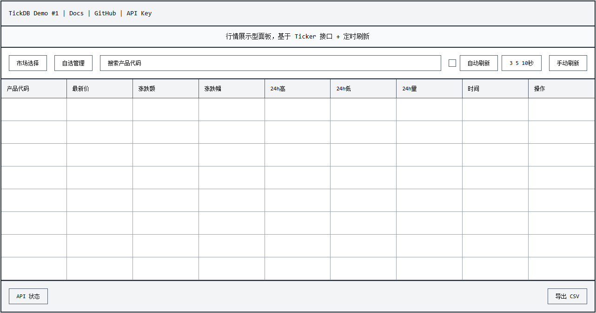

# Demo #1：Ticker 行情面板

## Demo 定位

这是一个基于 Ticker API 的行情展示 Demo，属于展示 / 快照类场景。

通过 HTTP 请求获取行情数据并在网页中展示，不涉及 WebSocket 或高频推送。

## 界面预览



## 文章对应关系

本目录代码对应文章《用 Ticker API 写一个行情面板：一次完整的实现过程》。

代码实现与文章内容保持一致，后续功能演进会在新的 Demo 目录中继续展开。

## 功能说明

- 多市场行情数据获取（外汇、贵金属、美股、港股、A股、加密货币）
- 行情表格展示（最新价、涨跌幅、24h 高低、成交量）
- 定时自动刷新与手动刷新
- 请求延迟展示
- 自选列表管理（localStorage 持久化）
- 市场筛选与搜索
- CSV 导出
- 错误码友好提示

## 如何运行

### 1. 配置 API Key

编辑 `src/config.js`，填入你的 API Key：

```javascript
window.TICKDB_CONFIG = {
  BASE_URL: "https://api.tickdb.ai",
  API_KEY: "YOUR_API_KEY",
  DEFAULT_SYMBOLS: ["EURUSD", "XAUUSD", "700.HK", "AAPL.US", "BTCUSDT"]
};
```

获取 API Key：https://tickdb.ai

### 2. 打开页面

使用浏览器直接打开 `src/index.html` 即可。

## 文件结构

```
demo-01-ticker-panel/
├── src/
│   ├── index.html    # 页面结构
│   ├── style.css     # 样式
│   ├── app.js        # 核心逻辑
│   └── config.js     # API 配置
├── wireframe.png     # 界面线框图
└── README.md         # 本文件
```

## 技术栈

- HTML/CSS/JavaScript（无框架依赖）
- TickDB Ticker API
- localStorage（自选列表持久化）
