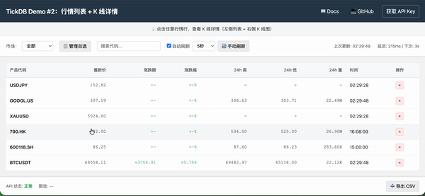

# Demo #2：Ticker + K线 行情面板

## Demo 定位

这是一个在 Demo #1 基础上的结构升级版本，在 Ticker 行情面板中加入了 K 线图表展示。

通过 HTTP 请求获取 Ticker 和 K 线数据，实现了主从面板的交互式布局，支持多时间周期切换和历史数据预加载。

## 设计目标

- 在不改变 Demo #1 路由结构的前提下，引入 K 线展示能力
- 保持实时行情与历史行情数据的职责分离
- 提供平滑的历史数据加载体验
- 确保代码实现与对应文章完全一致

## 界面预览



## 文章对应关系

本目录代码对应文章《在行情面板中加入 K 线：一次结构升级的实现过程》。

代码实现与文章内容保持一致，后续功能演进会在新的 Demo 目录中继续展开。

## 功能说明

### 继承自 Demo #1 的功能
- 多市场行情数据获取（外汇、贵金属、美股、港股、A股、加密货币）
- 行情表格展示（最新价、涨跌幅、24h 高低、成交量）
- 定时自动刷新与手动刷新
- 请求延迟展示
- 自选列表管理（localStorage 持久化）
- 市场筛选与搜索
- CSV 导出
- 错误码友好提示

### Demo #2 新增功能
- 主从面板布局（点击 Symbol 展开详情）
- K 线图表展示（基于 Lightweight Charts）
- 多时间周期切换（1分钟、5分钟、15分钟、1小时、1天）
- 行情快照展示（详细的 Ticker 数据）
- K 线历史数据预加载（智能加载更多历史数据）
- 最新 K 线实时更新
- 响应式图表调整

## 如何运行

### 1. 配置 API Key

编辑 `src/config.js`，填入你的 API Key：

```javascript
window.TICKDB_CONFIG = {
  BASE_URL: "https://api.tickdb.ai",
  API_KEY: "YOUR_API_KEY",
  DEFAULT_SYMBOLS: ["EURUSD", "XAUUSD", "700.HK", "AAPL.US", "BTCUSDT"]
};
```

获取 API Key：
https://tickdb.ai

### 2. 打开页面

使用浏览器直接打开 `src/index.html` 即可。

## 文件结构

```
demo-02-ticker-kline-panel/
├── src/
│   ├── index.html    # 页面结构
│   ├── style.css     # 样式
│   ├── app.js        # 核心逻辑
│   ├── config.js     # API 配置
│   └── panel.gif     # 界面演示
└── README.md         # 本文件
```

## 技术栈

- HTML/CSS/JavaScript（无框架依赖）
- TickDB Ticker API
- TickDB K线 API
- Lightweight Charts（图表库）
- localStorage（自选列表持久化）

## 适用场景

- 构建多市场实时行情展示系统
- 为股票、外汇、港股等品种增加历史走势分析能力
- 作为量化分析前端原型
- 学习行情 API 的时间序列处理方式

## 核心技术要点

### 1. 主从面板布局
- 点击 Symbol 后，左侧表格收缩为简化列表
- 右侧展开详情面板，显示行情快照和 K 线图表
- 支持收起详情，恢复全宽表格

### 2. K 线数据管理
- 按 `symbol@interval` 作为 key 缓存 K 线数据
- 首次加载固定批次 K 线（可见区 + 预留 buffer）
- 当可见区消耗 50% buffer 时触发下一次加载
- 使用最新 K 线 API 实时更新当前正在形成的 K 线
- 历史 K 线与最新 K 线分层处理
  - `/kline` 提供已完成周期
  - `/kline/latest` 仅用于补齐当前周期


### 3. 图表交互优化
- 响应式调整图表尺寸
- 保持可见范围不变（避免跳动）
- 防抖处理预加载请求（避免频繁触发）
- 静默加载历史数据（不影响当前显示）

## 与 Demo #1 的结构升级点

1. 新增 K 线图表展示能力
2. 引入主从面板交互式布局
3. 新增多时间周期切换
4. 新增历史数据预加载机制
5. 新增最新 K 线实时更新
6. 引入 Lightweight Charts 图表库

